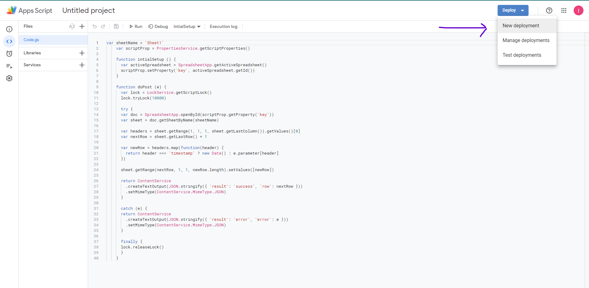
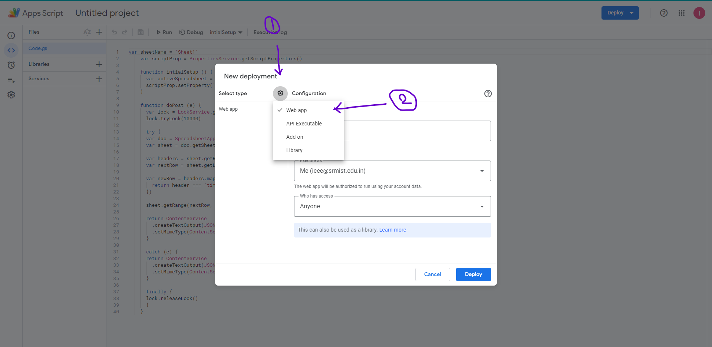
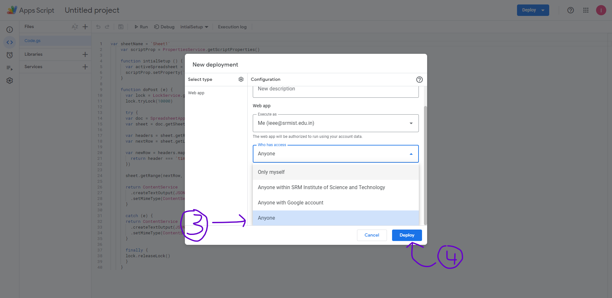
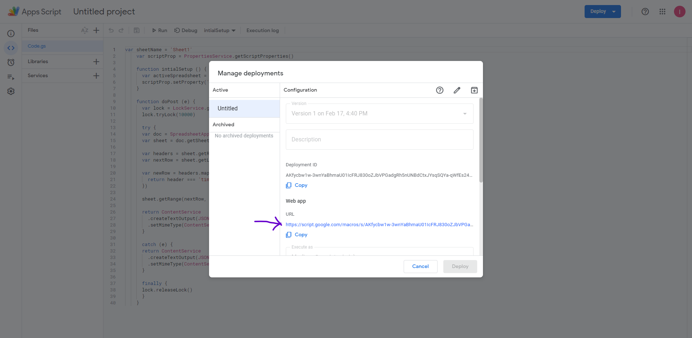
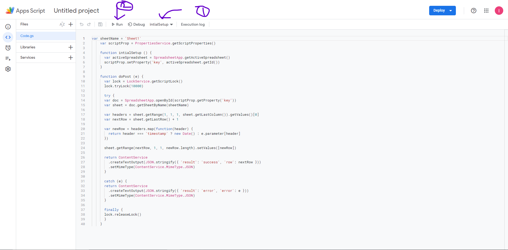
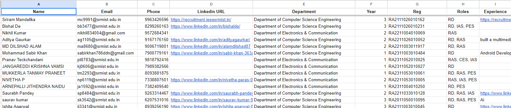
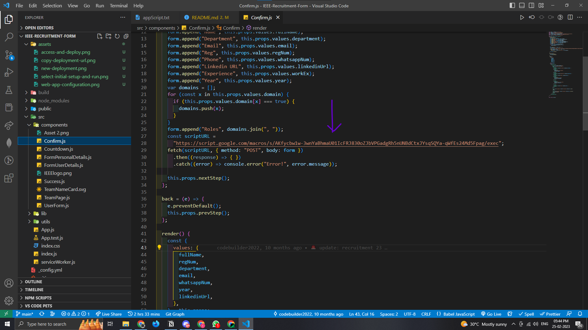

# IEEE Recruitment Form

> Form with multiple steps and confirmation. Frontend only, no API. Uses Material UI

**Table of Contents**:

- [App Script Set-up](#app-script-set-up)
- [Google Sheet Set-Up](#google-sheet-set-up)
- [Application Set-up](#application-set-up)
  - [Quick Start](#quick-start)
  - [Date & Content Updates](#date--content-changes)
- [Deployment](#deployment)

> Watch this YouTube video to get an idea of how to deploy the application: https://youtu.be/tUnuhu_Z9L8, same steps are mentioned below.

## App Script Set-Up

- Create a google sheet using your email ID or preferably IEEE SRM SBs email ID (ieee@srmist.edu.in).
- Create a new App Script from (Extensions -> App Script) and `Copy/Paste` the content from the [appScript.txt](/appScript.txt) file in to the sheets app script.
- Click on `Deploy` to deploy the app script.

- Update the configuration as `Web App`.

- Change the Access to Anyone and Deploy the app script.

- Copy the Deployment URL.

- Run the App Script's `initialSetup` function before configuring the application.


## Google Sheet Set-Up

- Add a header on the google sheet in order to accept responses.
- Do it in the following ordere.

- For additional setup, make it bold, text centered and freeze that specific row alone.

With this you're ready and set to get the application setup!

## Application Set-Up

### Quick Start

```bash
# Install dependencies
npm install

# Serve on localhost:3000
npm start

# Build for production
npm run build
```

### Date & Content Changes

- Replace the Deployment URL of the App Script in the [`src/components/Confirm.js`](/src/components/Confirm.js) file for the `scriptURL` variable.

- Update the last date to submit in [`src/components/UserForm.js`](/src/components/UserForm.js) file for the `lastDateToRegister` variable.
  - Note that it follows the 24 hours format, so set it according to that.
  - The Month starts from index 0, so for January it is 0, for February it is 1 and so on...
  - The form is closed automatically based on the date set in this part of the application.

- Update the content or title from the [`src/components/FormUserDetails.js`](/src/components/FormUserDetails.js) file and where ever required.


With this all the application changes required are done!

## Deployment

The Recruitment Application is hosted on netlify, and since we're a private repo on a organization account, we're deploying it through build uploads on netlify.

- Create a build for the application with the changes made above.

```bash
npm run build
```

- Go to Netlify Dashboard from IEEE SRMs Account.
- Open the Recruitment App Project.
- Go to `Deploys` and drag and drop the build folder to deploy.


> Note: For access to the Netlify account, and the GitHub repo contact your organization admin or your team lead to get the access.
